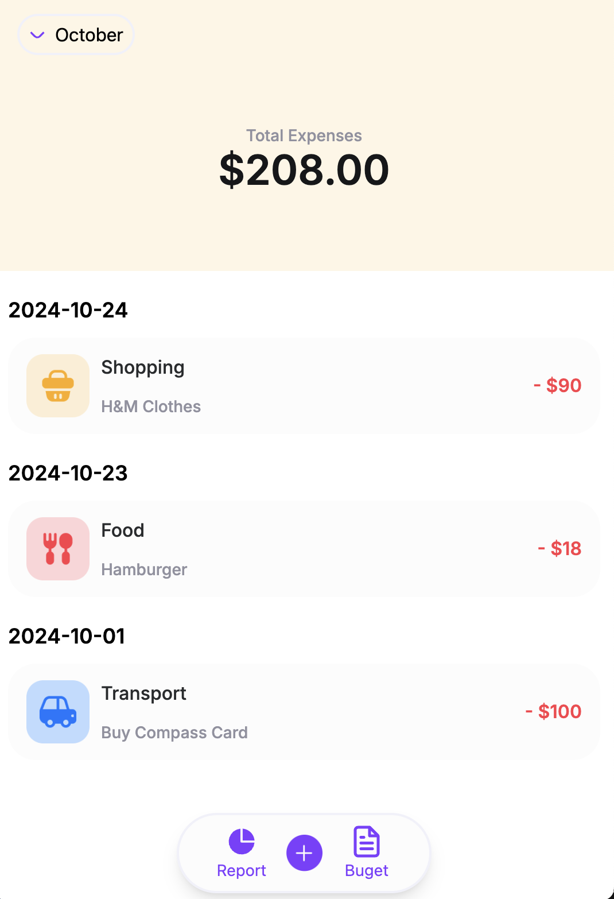
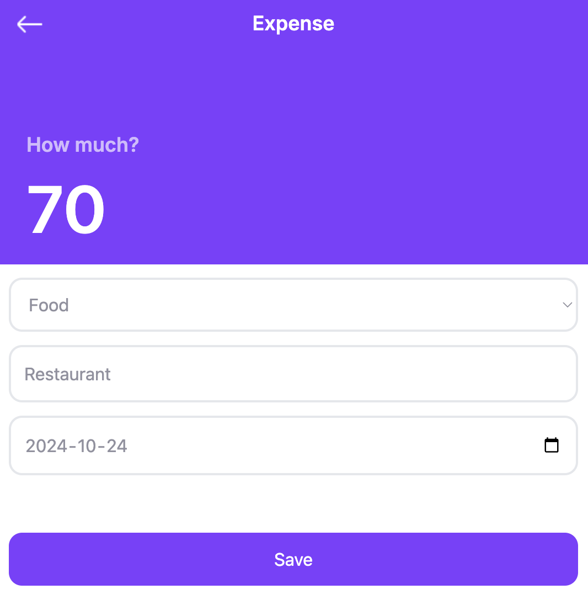
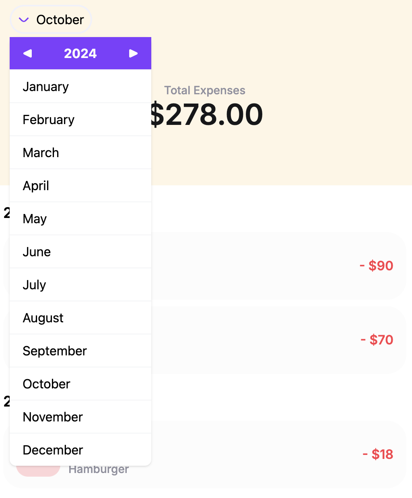
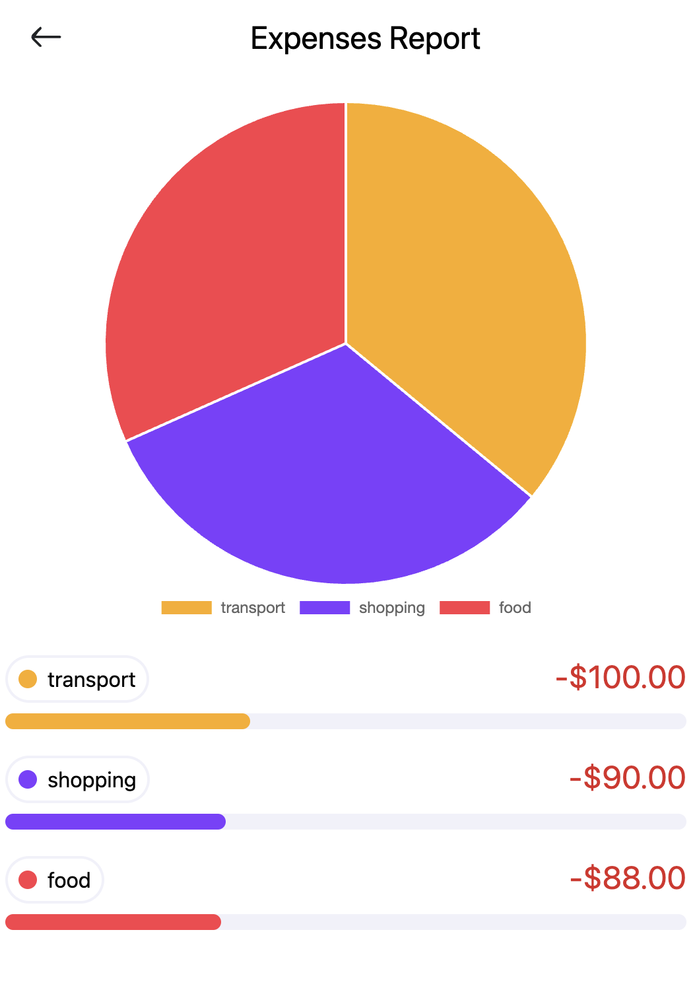
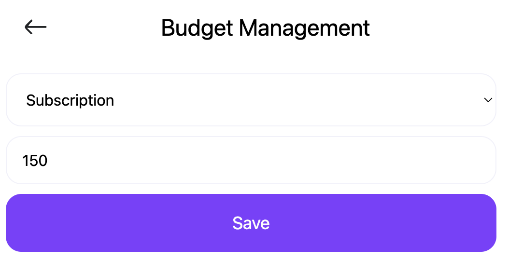
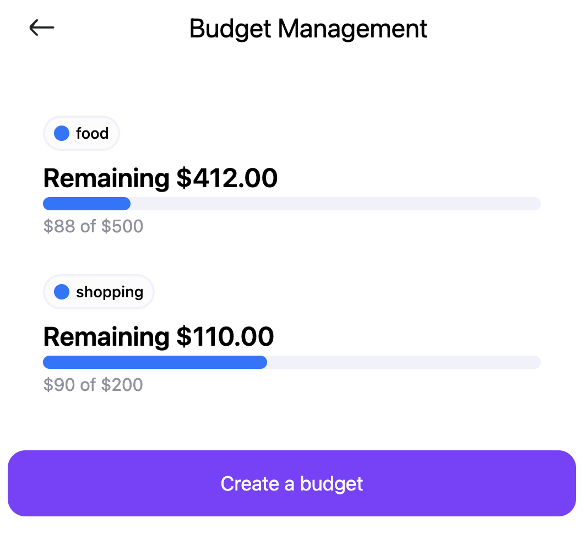

## Project Overview

The Expense Tracker is a web application that allows users to manage their personal finances by tracking their expenses. The application will use the browser’s local storage API to store data, ensuring that users can access their expense records even without an internet connection.

### Tech Stacks

- Frontend: `HTML`, `CSS`, `JavaScript`
- Data Storage: Browser’s `Local Storage API`
- Libraries/Frameworks (optional): `Chart.js` for visual summaries, `Tailwind CSS` for responsive design

## Preview

1. You can view the expense list, which is built using the browser's `local storage API` for data persistence.
   <br>

2. You can add or edit an expense item with a category, description, and date.
   <br>

3. You can view a report for the month, which is created using `Chart.js`.
   <br> 

4. You can create a budget by category for each month and view its status.
   <br> 

## For Developer

- You need to start the live server to run the application.
- When you try to apply custom variables in `tailwind.config.js`, you need to execute command below.
  ```
  npx tailwindcss -i ./css/input.css -o ./css/output.css --watch
  ```

## Contributor

- [@daheeahn](https://github.com/daheeahn)
- [@ljsunny](https://github.com/ljsunny)
- [@HNassifBraga](https://github.com/HNassifBraga)
- This is a [worksheet](https://docs.google.com/spreadsheets/d/1FN-86feM2sofXsQWZT-DAPK3RMGcVGP-8v-VdEqg824/edit?gid=0#gid=0) to track the progress of our work

## Copyright

This design is from [montra-expense-tracker-ui-kit](https://www.figma.com/community/file/998557875473123405/montra-expense-tracker-ui-kit) by Creator [@Braja Omar Justico](https://www.figma.com/@brajaomar)
We adopted a design from Figma, and the copyright belongs to this individual.
